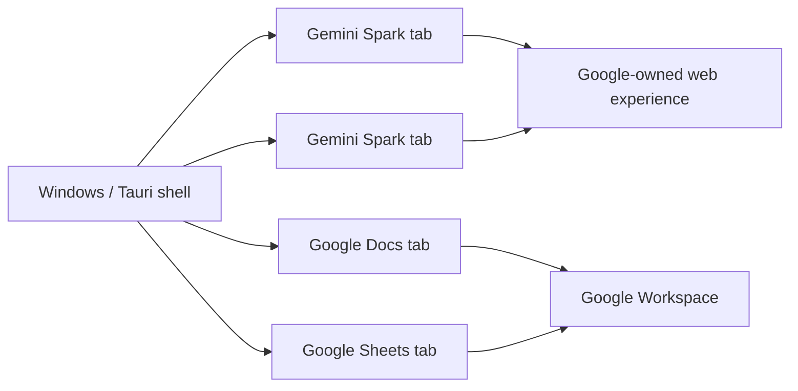

# Spark Desktop

> A focused Windows desktop shell for Gemini Spark — native tabs, Google Workspace continuity, persistent sessions, and signed automatic updates without turning Spark into another browser.

[](https://github.com/sufyanaser/Spark-Desktop/actions/workflows/ci.yml)
[](https://github.com/sufyanaser/Spark-Desktop/releases/latest)
[](#requirements)
[](https://v2.tauri.app/)

**Independent community project. Not affiliated with, endorsed by, or sponsored by Google.**

---

## Why this exists

Gemini Spark is already a web product. Spark Desktop does not try to replace its interface or rebuild Gemini with a private API.

Instead, it explores a smaller product idea:

**What if Spark could feel like a focused Windows workspace instead of a tab inside a general-purpose browser?**

The shell adds only the desktop behavior that improves that workflow:

- multiple Spark tabs in one native window;
- additional Spark windows;
- persistent Google session state;
- Google Docs and Sheets opened by Spark stay inside Spark Desktop tabs;
- native frameless window controls and drag behavior;
- keyboard-first tab controls;
- dark/light application chrome;
- signed automatic updates through GitHub Releases.

It intentionally does **not** add an address bar, bookmarks, browser history, extensions, or a custom Gemini UI.

## Product boundary



Spark Desktop owns the **desktop shell**. Google continues to own the **Gemini and Workspace web experiences, authentication, content, and service behavior**.

## Current capabilities

| Area | Behavior |
|---|---|
| Spark | Loads `https://gemini.google.com/spark` directly |
| Tabs | Multiple internal Spark / Workspace tabs |
| Windows | Multiple native Spark Desktop windows |
| Session | Shared persistent WebView2 application profile |
| Workspace | Docs / Sheets opened from Spark remain in-app |
| Window chrome | Native minimize, maximize/restore, close, drag-to-move |
| Shortcuts | `Ctrl+T`, `Ctrl+W`, `Ctrl+Tab`, `Ctrl+Shift+Tab`, `Ctrl+Shift+N`, `Ctrl+R` |
| Updates | Signed GitHub Releases + Tauri automatic updater |
| Platform | Windows / Microsoft Edge WebView2 |

## Engineering findings

Building a desktop WebView host around a modern Google workflow exposed several product-level integration lessons — especially around popup semantics, Google Workspace navigation, shared session state, and how little native chrome is actually needed.

The findings are documented here:

**[Gemini Spark on Desktop — Product & Integration Findings](docs/GEMINI_SPARK_DESKTOP_FINDINGS.md)**

This document is designed to be useful as constructive technical feedback for the Gemini community and product/developer teams.

## Architecture

```text
Tauri 2 native window
├─ React / TypeScript shell (trusted local UI)
│  └─ 40px top bar: tabs + native window controls
└─ Child WebView2 instances
   ├─ Gemini Spark
   ├─ Gemini Spark
   ├─ Google Docs
   └─ Google Sheets
```

Key decisions:

- remote Gemini/Google content does not receive Spark Desktop native Tauri capabilities;
- tabs share the application WebView2 data store for consistent Google session behavior;
- Workspace routing is deliberately narrow instead of becoming a general browser;
- application releases are delivered through signed updater artifacts.

See **[Architecture](docs/ARCHITECTURE.md)** for the implementation model.

## Automatic updates

Routine users should not need to download a new installer after every fix.

The release path is:

```text
develop
→ validation
→ main
→ signed GitHub Release
→ latest.json
→ installed Spark Desktop
→ automatic update
```

Installed copies check the signed GitHub Releases channel on launch. Validation installers produced by CI are diagnostics, not the normal update path.

## Requirements

- Windows 10/11
- Microsoft Edge WebView2 Runtime
- A Google account with access to the Gemini Spark experience you intend to use

Availability and behavior of Gemini Spark and Google Workspace are controlled by Google and may change independently of this project.

## Development

```bash
npm ci
npm run lint
npm run build
npm run tauri dev
```

Native validation:

```bash
cd src-tauri
cargo check
```

## Repository model

- `develop` — development source of truth.
- `main` — released state.
- feature/fix/chore work targets `develop`.
- validated release preparation promotes `develop` to `main`.

See **[CONTRIBUTING.md](CONTRIBUTING.md)** before submitting changes.

## Project documents

- **[Architecture](docs/ARCHITECTURE.md)** — runtime and security boundaries.
- **[Gemini Spark Desktop Findings](docs/GEMINI_SPARK_DESKTOP_FINDINGS.md)** — product/integration lessons from the prototype.
- **[Security Policy](SECURITY.md)** — vulnerability reporting and trust boundaries.
- **[Public Launch Checklist](docs/PUBLIC_LAUNCH_CHECKLIST.md)** — release/presentation/outreach readiness.

## Trademark & affiliation notice

Spark Desktop is an independent project and is **not affiliated with, endorsed by, or sponsored by Google**.

"Google", "Gemini", "Gemini Spark", "Google Docs", and "Google Sheets" are used only to identify the products with which Spark Desktop is designed to interoperate. All trademarks and product names belong to their respective owners.

The Spark Desktop project should use its own name, iconography, and visual identity and should not imply an official Google partnership.

## License

See [LICENSE](LICENSE).

The repository currently uses an **all-rights-reserved** license. Source visibility does not by itself make the project open source. A permissive open-source license can be adopted later only as an explicit project-owner decision.
