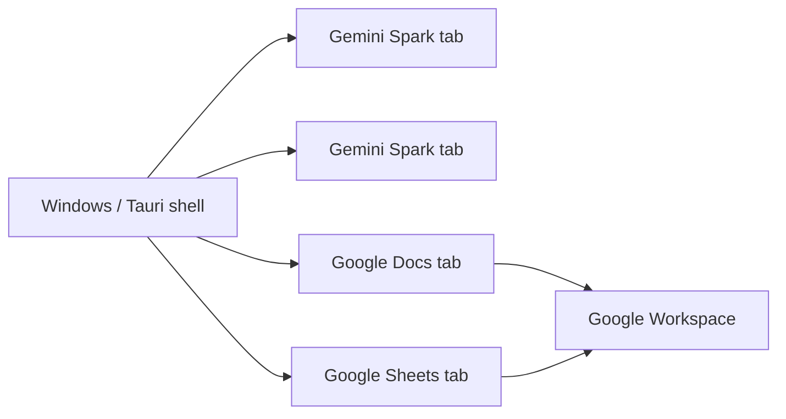

# Spark Desktop

> A focused Windows desktop shell for Gemini Spark with native tabs, Google Workspace continuity, persistent sessions, and signed automatic updates.

[](https://github.com/sufyanaser/Spark-Desktop/releases/latest)
[](https://github.com/sufyanaser/Spark-Desktop/actions/workflows/ci.yml)


**[Download the latest signed Windows release](https://github.com/sufyanaser/Spark-Desktop/releases/latest)**

**Independent community project. Not affiliated with, endorsed by, or sponsored by Google.**

## Why this exists

Gemini Spark is already a web product. Spark Desktop does not try to replace its interface. It explores a smaller idea:

**What if Spark could feel like a focused Windows workspace instead of a tab inside a general-purpose browser?**

Spark Desktop adds only the desktop behavior that improves that workflow:

- multiple Spark tabs in one native window;
- additional Spark windows;
- persistent session state;
- Google Docs and Sheets opened by Spark stay inside Spark Desktop tabs;
- native frameless window controls;
- keyboard-first tab controls;
- dark/light application chrome;
- signed automatic updates through GitHub Releases.

It intentionally does **not** add an address bar, bookmarks, browser history, extensions, or a replacement Gemini UI.

## Product boundary



Spark Desktop owns the **desktop shell**. Google continues to own the **Gemini and Workspace web experiences and service behavior**.

## Current capabilities

| Area | Behavior |
|---|---|
| Spark | Opens `https://gemini.google.com/spark` directly |
| Tabs | Multiple internal Spark / Workspace tabs |
| Windows | Multiple native Spark Desktop windows |
| Session | Shared persistent WebView2 application profile |
| Workspace | Docs / Sheets opened from Spark remain in-app |
| Window chrome | Native minimize, maximize/restore, close, drag-to-move |
| Shortcuts | `Ctrl+T`, `Ctrl+W`, `Ctrl+Tab`, `Ctrl+Shift+Tab`, `Ctrl+Shift+N`, `Ctrl+R` |
| Updates | Signed GitHub Releases + Tauri automatic updater |
| Platform | Windows / Microsoft Edge WebView2 |

## Engineering findings

Building a desktop WebView host around a modern Google workflow exposed product-level integration lessons around popup behavior, Workspace navigation, shared session state, and how little native chrome is actually needed.

**[Read: Gemini Spark on Desktop — Product & Integration Findings](docs/GEMINI_SPARK_DESKTOP_FINDINGS.md)**

## Architecture

```text
Tauri 2 native window
├─ React / TypeScript shell
│  └─ 40px top bar: tabs + native window controls
└─ Child WebView2 instances
   ├─ Gemini Spark
   ├─ Gemini Spark
   ├─ Google Docs
   └─ Google Sheets
```

See **[Architecture](docs/ARCHITECTURE.md)** for the implementation model.

## Install on Windows

1. Open the [latest GitHub Release](https://github.com/sufyanaser/Spark-Desktop/releases/latest).
2. Download `Spark.Desktop_<version>_x64-setup.exe`.
3. Run the installer and launch **Spark Desktop**.

Installed copies use signed updater metadata from GitHub Releases for routine updates.

## Development

```bash
npm ci
npm run lint
npm run build
npm run tauri dev
```

Native validation:

```bash
cd src-tauri
cargo check
```

## Repository model

- `develop` — development source of truth.
- `main` — released/public state.
- feature/fix/chore work targets `develop`.
- validated release preparation promotes `develop` to `main`.

## Project documents

- **[Architecture](docs/ARCHITECTURE.md)** — runtime model.
- **[Gemini Spark Desktop Findings](docs/GEMINI_SPARK_DESKTOP_FINDINGS.md)** — product/integration lessons.
- **[Security Policy](SECURITY.md)** — security reporting.
- **[Support](SUPPORT.md)** — issue reporting guidance.
- **[Public Launch Checklist](docs/PUBLIC_LAUNCH_CHECKLIST.md)** — launch readiness.
- **[Outreach Kit](docs/OUTREACH_KIT.md)** — ready-to-use launch copy.
- **[Repository Presentation](docs/REPOSITORY_PRESENTATION.md)** — About metadata and visual asset guidance.

## Trademark & affiliation notice

Spark Desktop is an independent project and is **not affiliated with, endorsed by, or sponsored by Google**.

"Google", "Gemini", "Gemini Spark", "Google Docs", and "Google Sheets" are used only to identify compatible products and services. All trademarks and product names belong to their respective owners.

Spark Desktop should use its own name, iconography, and visual identity and should not imply an official Google partnership.

## License

See [LICENSE](LICENSE).

The repository currently uses an **all-rights-reserved** license. Source visibility does not by itself make the project open source. Adopting a permissive open-source license is a separate project-owner decision.
